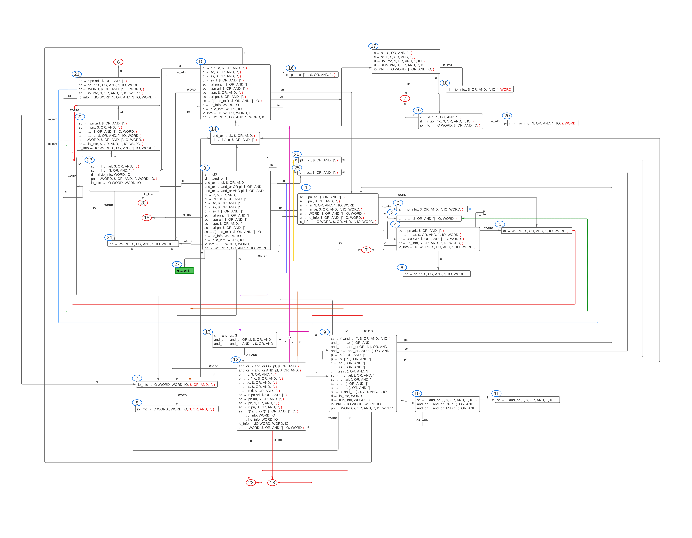

# Introduction

[Minishell](#minishell) is a project from the cursus of the school 42 (campus of Le Havre).

The goal of this project is to make a rather simple shell. See the list of [features](#features) down below.

---
# Dependencies

## List

- [microparser](#microparser)
- [libft](#libft)
- [readline](#readline)

### Microparser

[microparser](https://github.com/Lailouezzz/microparser), a home made `LR` / `LALR` / `SLR` parser made by [ale-boud](https://github.com/lailouezzz).

### Libft

[libft](https://github.com/Dyamen1411/42-libft-full), the full libft (highly documented) made by [amassias](https://github.com/Dyamen1411).

### Readline

[readline](https://www.gnu.org/software/readline), command line edition, history support ([GNU](www.gnu.org))

---

# Minishell

## Build

Commands to build minishell :

```sh
git clone --recurse-submodules https://github.com/Lailouezzz/minishell
cd minishell
./configure.sh && make
```

## Features

- [x] `Prompt` when waiting for a new command
- [x] Working `history`
- [x] Search and launch the right executable (based on the `PATH` variable or using a
relative or an absolute path).
- [x] Not interpret unclosed quotes or special characters which are not required by the
subject such as `\` (backslash) or `;` (semicolon)
- [x] `’` (single quote) should prevent the shell from interpreting the meta-
characters in the quoted sequence
- [x] `"` (double quote) should prevent the shell from interpreting the meta-
characters in the quoted sequence except for `$` (dollar sign)
- [x] Redirections
	- [x] `<` redirects input
	- [x] `>` redirects output
	- [x] `<< [DELIMITER]` reads the input until a line containing the
delimiter is seen. However, it doesn’t have to update the history
	- [x] `>>` redirects output in append mode
- [x] Pipes (`|` character). The output of each command in the pipeline is
connected to the input of the next command via a pipe
- [x] Environment variables (`$` followed by a sequence of characters) which
should expand to their values
- [x] `$?` which should expand to the exit status of the most recently executed
foreground pipeline
- [x] `Ctrl-C`, `Ctrl-D` and `Ctrl-\` which should behave like in bash
- [x] Interactive mode
	- [x] `Ctrl-C` displays a new `prompt` on a new line
	- [x] `Ctrl-D` exits the shell
	- [x] `Ctrl-\` does nothing
- [x] Builtins
	- [x] `echo` with option -n
	- [x] `cd` with only a relative or absolute path
	- [x] `pwd` with no options
	- [x] `export` with no options
	- [x] `unset` with no options
	- [x] `env` with no options or arguments
	- [x] `exit` with no option
- [x] Command chaining (`&&` and `||`)
- [x] Subshell with `(COMMAND)`
- [x] Wildcard (`*` character) for the current working directory

## Automaton

This project is powered by a [`DFA`](https://en.wikipedia.org/wiki/Deterministic_finite_automaton) (deterministic finite automaton) `LALR(1)` made from a simplified `bash` grammar.

### Grammar

```EBNF
command_line ::= and_or

and_or ::= pipeline | and_or AND_OR pipeline

pipeline ::= command | pipeline '|' command

command ::= simple_command | subshell redirect_list | subshell

subshell ::= '(' and_or ')'

simple_command ::= redirect_list pn args_red_list
				| pn args_red_list
				| redirect_list pn
				| pn

redirect_list ::= io_info | redirect_list io_info

io_info ::= IO WORD

pn ::= WORD

args_red_list ::= args_red | args_red_list args_red

args_red ::= WORD | io_info
```

### Automaton representation



## Todo

- Doxygen documentation

---
# Authors

<table>
	<tr>
		<td>  </td>
		<td>  </td>
	</tr>
	<tr>
		<td style="text-align:center"> <a href="https://github.com/lailouezzz">ale-boud</a> </td>
		<td style="text-align:center"> <a href="https://github.com/Dyamen1411">amassias</a> </td>
	</tr>
</table>
